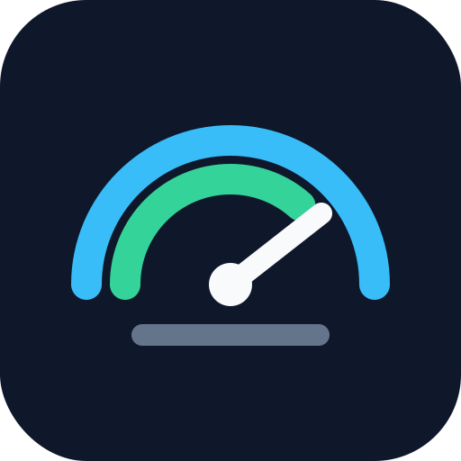

# Codex Gauge

**Codex Gauge** is an unofficial macOS menu-bar meter for local Codex usage.

It reads token-count metadata from your local `~/.codex` session logs, estimates
usage with configurable token rates, and shows your week-to-date spend against
weekly budget thresholds.



## What It Shows

The menu-bar title defaults to:

```text
Gauge $4.69/$100
```

The dropdown shows:

- today, week, and month estimated usage
- weekly soft budget progress
- weekly max budget progress
- last refresh time
- a reminder that the values are local estimates, not official billing

By default, Codex Gauge uses:

```json
{
  "weekly_soft_budget_usd": 30.0,
  "weekly_max_budget_usd": 100.0
}
```

You can edit those values in:

```text
~/.codex-gauge.json
```

The app reloads that config each time it refreshes.

## Install

Requirements:

- macOS 11 or newer
- Python 3
- Xcode command line tools for `swiftc`

Install:

```bash
git clone https://github.com/claudecody/codex-gauge.git
cd codex-gauge
scripts/install.sh
```

The installer:

- builds the native Swift menu-bar app
- installs it to `~/Applications/CodexGauge.app`
- creates `~/.codex-gauge.json` if missing
- adds `codex-gauge` to `~/.local/bin`
- registers a user LaunchAgent so the app starts at login
- opens the app immediately in the top-right macOS menu bar

After install, launch it manually with:

```bash
codex-gauge
```

If it does not appear immediately, macOS may have hidden it behind crowded
menu-bar items. Quit another menu-bar app or widen the menu bar area and run
`codex-gauge` again.

## Uninstall

```bash
scripts/uninstall.sh
```

The uninstaller removes the app, login item, and launcher. It keeps
`~/.codex-gauge.json` so you do not lose your budget settings.

## Privacy

Codex Gauge is local-only.

It reads Codex session log metadata from `~/.codex`, specifically token-count
events and the local Codex state database. It does not read authentication
tokens, does not inspect auth caches, and does not send usage data anywhere.

## Accuracy

Codex Gauge is a pressure gauge, not a billing system.

The values are estimates from local Codex logs using configurable hypothetical
rates. They are not official OpenAI billing, quota, or account entitlement
figures.

The bundled usage helper defaults to these hypothetical rates:

```text
uncached input: $5.00 / 1M tokens
cached input:   $0.50 / 1M tokens
output:        $30.00 / 1M tokens
unknown:        $5.00 / 1M tokens
```

## Development

Build and check:

```bash
make check
make build
```

Run the usage helper directly:

```bash
scripts/codex-gauge-usage.py --period week --format json
```

Install the local build:

```bash
make install
```

## Branding

Codex Gauge is intentionally lightweight: one glance in the menu bar, one click
for detail. The logo and app use a gauge metaphor because the numbers are
directional estimates rather than official billing statements.

## License

MIT
